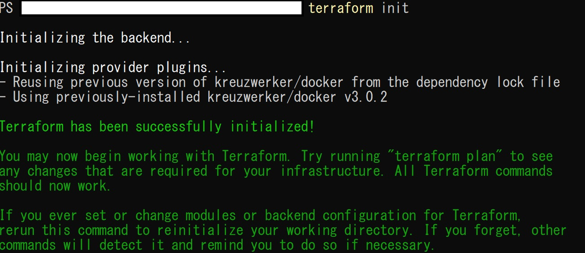
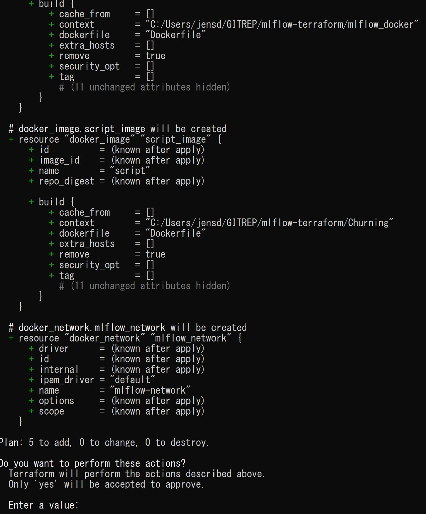
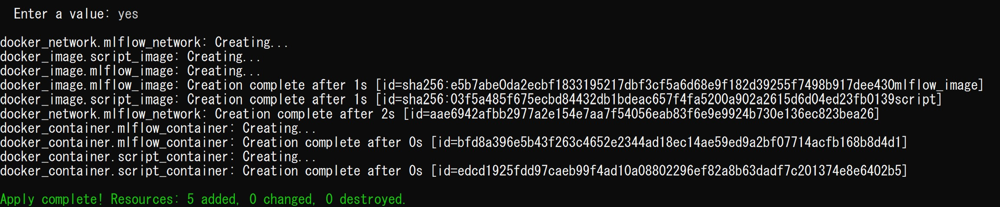
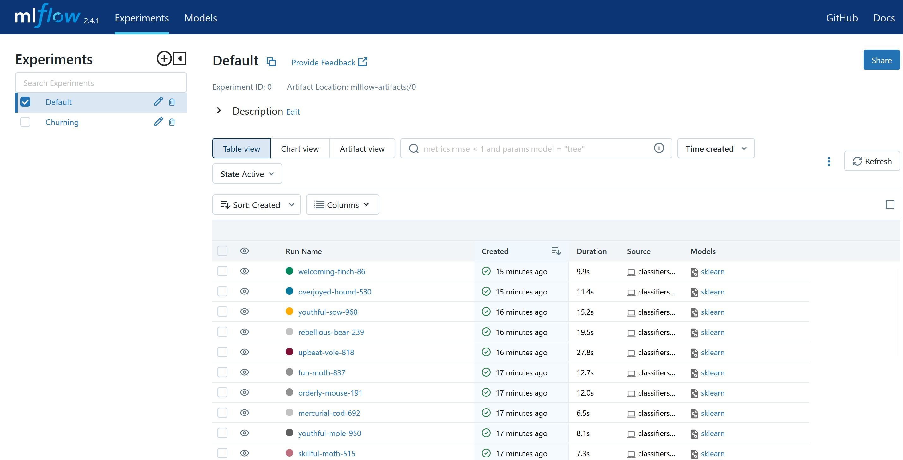

# Terraform and MLFlow

[![LinkedIn][linkedin-shield]][linkedin-url]

<!-- ABOUT THE PROJECT -->
## About The Project

In this project, we're setting up two environments using Docker containers: an MLFlow environment and an application environment.

Here's how it works:

1. Building Docker Containers:
We use Docker to create containers for both the MLFlow environment and the application environment.
These containers encapsulate all the dependencies and configurations needed for each environment.

2. Deployment with Terraform:
We use Terraform, a tool for automating infrastructure deployment, to manage the deployment process.
Terraform takes care of setting up and configuring the infrastructure needed for our environments.

3. Workflow:
First, Terraform builds the Docker images for both the MLFlow environment and the application environment.
Then, it deploys these images, creating the necessary infrastructure to run our environments.

4. Benefits:
Using Docker allows us to easily package and distribute our environments, ensuring consistency across different systems.
Terraform simplifies the deployment process, making it reproducible and scalable.

In summary, our project streamlines the setup and deployment of MLFlow and application environments using Docker containers and Terraform. 🛠️

The application is based on another [project](https://github.com/ArianaBik96/Customer_churn_analysis) from a colleague in the BeCode AI trajectory. In their project they looked at multiple classification models. This application environment looks at only one (randomforestclassifier) and tunes the hyperparameters of it, tracks the runs and logs the best model in MLFlow.

### Built With

### Project structure

    │  main.tf
    │  README.md
    │
    ├─Churning
    │  │  Dockerfile
    │  │  requirements.txt
    │  │
    │  ├─data
    │  │      BankChurners.csv
    │  │
    │  └─src
    │         classifiers.py
    │         preprocessing.py
    │      
    └─mlflow_docker
           Dockerfile
           requirements.txt

The Churning and mlflow_docker directories contain the Dockerfile for the two different containers we want to build and deploy.

<!-- GETTING STARTED -->
## Getting Started

### Prerequisites

This project requires you to have both [Terraform](https://developer.hashicorp.com/terraform/install) and [Docker desktop](https://docs.docker.com/desktop/) installed.
Docker Desktop has to be running for this to work.

### Installation

Simply clone the repo:
~~~
git clone https://github.com/DedeyJ/mlflow-terraform.git
~~~

Or download and unzip the source code in your preferred local directory

<!-- USAGE EXAMPLES -->
## Usage

Go to your preferred CLI, make sure you're in the directory with the 'main.tf' file  and perform the following command:

to initiliaze use:
~~~
terraform init
~~~

to build: 
~~~
terraform apply
~~~

When it tells you to enter a value, type 'yes'

When you go to http://localhost:5000, you'll see an output similar to this: 

### Volumes
I added volumes for the application container, which will allow you to change the application files. 
|Local directory|Docker directory|
|---|---|
|/Churning/src|/src|
|/Churning/data|/data|

This allows me to change the application files to allow tracking and logging of other experiments and models if necessary. Take note that the application runs the classifiers.py file from the Churning/src folder so make sure the file you want to run has the same name. 

<!-- ROADMAP -->
## Roadmap

* Deployment in [Cloud](https://github.com/DedeyJ/terraform-cloud)

## Timeline

This was done in 5 days, including the time neede to learn both MLFlow and Terraform.

<!-- CONTACT -->
## Contact

Jens Dedeyne - [LinkedIn](https://www.linkedin.com/in/jens-dedeyne/)

Project Link: [GitHub](https://github.com/DedeyJ/mlflow-terraform)

<!-- MARKDOWN LINKS & IMAGES -->
<!-- https://www.markdownguide.org/basic-syntax/#reference-style-links -->
[contributors-shield]: https://img.shields.io/github/contributors/github_username/repo_name.svg?style=for-the-badge
[contributors-url]: https://github.com/github_username/repo_name/graphs/contributors
[forks-shield]: https://img.shields.io/github/forks/github_username/repo_name.svg?style=for-the-badge
[forks-url]: https://github.com/github_username/repo_name/network/members
[stars-shield]: https://img.shields.io/github/stars/github_username/repo_name.svg?style=for-the-badge
[stars-url]: https://github.com/github_username/repo_name/stargazers
[issues-shield]: https://img.shields.io/github/issues/github_username/repo_name.svg?style=for-the-badge
[issues-url]: https://github.com/github_username/repo_name/issues
[license-shield]: https://img.shields.io/github/license/github_username/repo_name.svg?style=for-the-badge
[license-url]: https://github.com/github_username/repo_name/blob/master/LICENSE.txt
[linkedin-shield]: https://img.shields.io/badge/-LinkedIn-black.svg?style=for-the-badge&logo=linkedin&colorB=555
[linkedin-url]: https://www.linkedin.com/in/jens-dedeyne/
[product-screenshot]: images/screenshot.png
[Next.js]: https://img.shields.io/badge/next.js-000000?style=for-the-badge&logo=nextdotjs&logoColor=white
[Next-url]: https://nextjs.org/
[React.js]: https://img.shields.io/badge/React-20232A?style=for-the-badge&logo=react&logoColor=61DAFB
[React-url]: https://reactjs.org/
[Vue.js]: https://img.shields.io/badge/Vue.js-35495E?style=for-the-badge&logo=vuedotjs&logoColor=4FC08D
[Vue-url]: https://vuejs.org/
[Angular.io]: https://img.shields.io/badge/Angular-DD0031?style=for-the-badge&logo=angular&logoColor=white
[Angular-url]: https://angular.io/
[Svelte.dev]: https://img.shields.io/badge/Svelte-4A4A55?style=for-the-badge&logo=svelte&logoColor=FF3E00
[Svelte-url]: https://svelte.dev/
[Laravel.com]: https://img.shields.io/badge/Laravel-FF2D20?style=for-the-badge&logo=laravel&logoColor=white
[Laravel-url]: https://laravel.com
[Bootstrap.com]: https://img.shields.io/badge/Bootstrap-563D7C?style=for-the-badge&logo=bootstrap&logoColor=white
[Bootstrap-url]: https://getbootstrap.com
[JQuery.com]: https://img.shields.io/badge/jQuery-0769AD?style=for-the-badge&logo=jquery&logoColor=white
[JQuery-url]: https://jquery.com 
